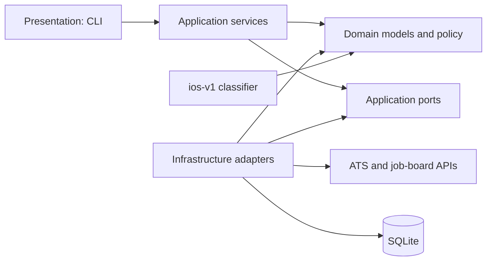

# JobScout

JobScout is a multi-source job discovery and intelligence platform that
collects, normalizes, deduplicates, and classifies vacancies from heterogeneous
ATS platforms and job boards.

> **Status: Active Development** — the collection and deterministic iOS
> classification pipeline is implemented. Selective AI-assisted analysis and
> ranking are planned, not presented as current functionality.

## Why JobScout

Relevant vacancies are fragmented across company ATS platforms, aggregators,
and community channels. Each source exposes different schemas, identifiers,
and failure modes, while the same role may appear through several paths.
JobScout creates one normalized, provenance-aware pipeline for discovering and
evaluating those opportunities without hiding uncertain data behind a single
opaque score.

## Current Capabilities

- **Multi-source collection:** production adapters for Greenhouse, Lever,
  Ashby, Recruitee, AgileFluent, and the official hh.ru API.
- **Validated company registry:** 92 configured entries across six source
  types; 91 are enabled for the default collection workflow. The hh.ru entry is
  disabled by default and invoked explicitly when OAuth is configured.
- **Asynchronous ingestion:** one shared `httpx.AsyncClient`, bounded
  per-company concurrency, and isolated provider failures so one broken source
  does not stop the remaining collection run.
- **Normalized domain model:** provider DTOs are validated and translated into
  framework-independent companies, vacancies, source observations, health
  states, and classifications.
- **Durable provenance:** every discovered source identity is stored as an
  observation linked to a preferred canonical vacancy.
- **Conservative deduplication:** exact normalized application URLs and explicit
  ATS references can collapse cross-source duplicates; similar employer/title
  records with distinct URLs remain separate for review. Official ATS content
  is preferred over aggregator content when observations converge.
- **Idempotent persistence:** repeated registry imports, collections, and
  `ios-v1` classifications update existing identities instead of creating
  duplicate records.
- **Explainable iOS classification:** a deterministic, versioned ruleset emits
  `MATCH`, `POSSIBLE_MATCH`, or `REJECT` with structured signals, warnings, and
  rejection reasons.
- **Operational source health:** `healthy`, `empty`, `failed`, and
  `invalid_configuration` are distinct persisted outcomes. A non-empty payload
  whose records are all malformed fails the source rather than masquerading as
  a legitimate empty result; mixed payloads preserve valid records.
- **CLI workflows:** registry import and inspection, collection, external
  collection, classification, candidate review, source health, duplicate
  diagnostics, and vacancy provenance inspection.
- **Legacy Telegram integration:** a separate Telethon collector scans
  configured channels, applies its own vacancy filters, and forwards matches to
  Saved Messages. It is intentionally not yet unified with the core pipeline.

## Architecture

JobScout is a modular monolith built around pragmatic Clean/Hexagonal
Architecture. Business models and deterministic policy live in the domain;
application services coordinate use cases through protocols; infrastructure
implements HTTP, registry, and persistence boundaries; presentation provides
the CLI composition root.



The source-code dependency direction is deliberately inward:

```text
Infrastructure -> Application -> Domain
Presentation   -> Application -> Domain
```

The domain imports no SQLAlchemy, Pydantic, httpx, Telethon, OpenAI, or CLI
framework. Provider DTOs stay inside source adapters, and ORM records stay
inside the persistence adapter.

The implemented collection path is:

```text
Public APIs -> source adapters -> CollectJobsService -> repositories -> SQLite
                                                        |
                                                        +-> source health
SQLite -> ios-v1 classifier -> persisted decisions -> CLI candidate view
```

The legacy Telegram collector is a parallel integration and does not currently
write into this normalized pipeline.

## Technology

- Python 3.12+, `asyncio`, and `httpx`
- SQLAlchemy 2.x async with SQLite and `aiosqlite`
- Alembic schema migrations
- Pydantic v2 and `pydantic-settings` at untrusted/configuration boundaries
- Telethon for the separate Telegram collector
- pytest and pytest-asyncio
- Ruff formatting and linting
- mypy in strict mode for `src/job_search`

FastAPI and an LLM provider are intentionally absent from the current stack.

## Engineering Highlights

### Explicit failure semantics

An empty source is valid data; a malformed non-empty response is not. Adapters
validate response envelopes and individual records, retain valid records from
mixed payloads, and surface all-malformed payloads as typed source failures.
This prevents upstream schema drift from silently looking like “no vacancies.”

### Bounded concurrency with isolated failures

HTTP collection runs concurrently behind an `asyncio.Semaphore`, while SQLite
writes use a short application-level lock. This keeps network I/O efficient,
avoids SQLite writer contention, and records per-company failures without
cancelling unrelated work.

### Provenance-first canonicalization

JobScout stores both a canonical vacancy and its source observations. It merges
only on high-confidence URL or embedded ATS identity evidence and preserves
ambiguous records. That bias favors explainability and prevents aggressive
fuzzy matching from combining unrelated roles.

### Versioned deterministic policy

The `ios-v1` classifier is explainable and reproducible. Classification records
are keyed by `(vacancy_id, classifier_version)`, so a future policy can coexist
with historical results instead of overwriting how a previous decision was
made.

### Typed, migration-backed boundaries

Frozen domain dataclasses, application protocols, validated provider DTOs, and
explicit database migrations keep external payloads and ORM concerns from
leaking into business policy. Registry import is whole-file validated before
any database write.

## Quality

The current repository contains **199 passing tests**, including unit,
integration, migration, adapter-contract, canonicalization, concurrency, and
classification regression coverage.

The local quality gate runs:

```bash
make quality
.venv/bin/alembic check
git diff --check
```

`make quality` combines Ruff lint and format checks, strict mypy, and pytest.
There is no CI badge because CI has not been implemented yet.

## Development Status

### Implemented

- six HTTP source adapters and a validated 92-entry registry;
- async normalized collection with bounded concurrency and provider isolation;
- async SQLite persistence and Alembic migrations;
- source observations, conservative cross-source canonicalization, and
  duplicate diagnostics;
- persisted source-health and malformed-source semantics;
- deterministic `ios-v1` classification and candidate inspection;
- a separate Telegram-to-Saved-Messages collection path;
- strict static analysis and a 199-test automated suite.

### In Progress / Next

- consistent retry/backoff policy across source adapters (hh.ru already has
  limited targeted retry behavior);
- vacancy lifecycle reconciliation when roles disappear from a source;
- a query layer over normalized vacancies and classifications;
- operational hardening of scheduled collection and local runtime security.

### Planned

- FastAPI query surface;
- typed contracts and an evaluation dataset for AI-assisted analysis;
- structured LLM extraction and ranking, introduced only after evaluation;
- unified delivery, including Telegram, from the normalized pipeline;
- additional source integrations where official or permitted APIs exist.

## AI-Assisted Engineering

Coding agents are used as implementation tools inside a controlled engineering
workflow:

```text
Requirement -> repository analysis -> scoped specification -> implementation
            -> automated verification -> review -> remediation -> accepted commit
```

AI output is not treated as authority. Tests and static analysis check
mechanical correctness; architecture, scope, and product intent remain subject
to human review. Risk-sensitive iterations can add an independent adversarial
review before acceptance. Generated changes are inspected and verified before
they become a published commit.

## Running Locally

### 1. Install

Requirements: Python 3.12+ and SQLite.

```bash
python3.12 -m venv .venv
.venv/bin/python -m pip install --upgrade pip
.venv/bin/python -m pip install -e '.[dev]'
cp .env.example .env
```

Keep `.env` local. It is ignored by Git and must contain your own credentials,
never values copied from another environment.

### 2. Initialize the database and registry

```bash
.venv/bin/alembic upgrade head
.venv/bin/job-search seed
```

The default database is `job_search.db`. The seed command validates and imports
[`data/companies.json`](data/companies.json) idempotently.

### 3. Collect, classify, and inspect

```bash
.venv/bin/job-search collect
.venv/bin/job-search classify
.venv/bin/job-search candidates --limit 20
```

Useful diagnostic commands:

```bash
.venv/bin/job-search companies list
.venv/bin/job-search companies health
.venv/bin/job-search duplicates
.venv/bin/job-search vacancy sources <canonical-vacancy-uuid>
```

The disabled hh.ru source requires a registered OAuth token in
`JOB_SEARCH_HH_API_TOKEN` and is run explicitly:

```bash
.venv/bin/job-search collect-external --source hh
```

No anonymous fallback is attempted because anonymous hh.ru vacancy search is
CAPTCHA-limited.

### Configuration

Core settings use the `JOB_SEARCH_` prefix. The most useful controls are:

| Variable | Default | Purpose |
|---|---:|---|
| `JOB_SEARCH_DATABASE_URL` | `sqlite+aiosqlite:///./job_search.db` | Async SQLite database |
| `JOB_SEARCH_COLLECTION_CONCURRENCY` | `8` | Concurrent company collections |
| `JOB_SEARCH_HTTP_MAX_CONNECTIONS` | `20` | HTTP pool bound |
| `JOB_SEARCH_EXTERNAL_DISCOVERY_MAX_AGE_HOURS` | `72` | hh.ru freshness window |
| `JOB_SEARCH_EXTERNAL_DISCOVERY_MAX_PAGES` | `5` | hh.ru page bound per query |
| `JOB_SEARCH_HH_API_TOKEN` | unset | Required only for hh.ru |

See [`.env.example`](.env.example) for the complete non-secret template.

### Legacy Telegram collector

Set `TELEGRAM_API_ID`, `TELEGRAM_API_HASH`, and `TELEGRAM_PHONE` in `.env`, then
use either a one-shot scan or continuous monitoring:

```bash
.venv/bin/python main.py --once
.venv/bin/python main.py
```

The collector keeps a local Telethon session and processing state, writes an
audit log, and sends matches to Saved Messages. Those runtime artifacts are
ignored and must not be committed.

#### macOS scheduling

[`launchd/local.job-scout.collector.plist`](launchd/local.job-scout.collector.plist)
is a portable template for the one-shot collector. Copy it to
`~/Library/LaunchAgents/`, replace every `__JOBSCOUT_PROJECT_DIR__` in the copy
with the absolute path to your checkout, and create the checkout's `logs/`
directory. The tracked schedule runs at 00:15, 06:15, 12:15, and 18:15.

```bash
plutil -lint "$HOME/Library/LaunchAgents/local.job-scout.collector.plist"
launchctl bootstrap "gui/$(id -u)" \
  "$HOME/Library/LaunchAgents/local.job-scout.collector.plist"
```

The tracked template is not read by an already installed LaunchAgent; changing
the repository file does not unload or alter an installed local job.

## Project Structure

```text
src/job_search/
  domain/                     Framework-independent models and iOS policy
  application/                Ports, use cases, and result models
  infrastructure/
    sources/                  Six external-source adapters
    persistence/sqlalchemy/   Async repository implementations
    registry/                 Validated company-registry loader
  presentation/               CLI composition root
tests/                        Unit, integration, and regression tests
migrations/                   Alembic revisions
data/companies.json           Versioned source registry
launchd/                      Portable macOS scheduling template
main.py                       Separate legacy Telegram collector
```

## Current Limitations

- Vacancy disappearance/closure is not reconciled across the general source
  pipeline. hh.ru can map an explicitly archived detail response to `closed`,
  but this is not a complete lifecycle system.
- Greenhouse list responses do not provide a reliable publication timestamp,
  so those records may have `published_at = NULL`.
- hh.ru requires OAuth; its adapter is disabled in the default registry.
- Remote, geography, language, and relocation decisions are conservative,
  phrase-based signals for human review—not legal eligibility conclusions.
- The current classifier targets iOS relevance only. Python, full-stack,
  project-management, and vibe-coding filters exist in the separate Telegram
  collector, not in the normalized core classifier.
- Find Dream Offer and LinkedIn are not collected directly: the former exposes
  an undocumented CAPTCHA-gated browser backend, while LinkedIn does not offer
  a suitable public job-search API for this use case. See the
  [source investigation](docs/phase-3b-source-investigation.md).
- There is no API server, LLM analysis, learned ranking, contact enrichment, or
  automatic application workflow.

## Roadmap

1. Generalize source reliability with consistent retry and backoff semantics.
2. Reconcile vacancy lifecycle and stale/closed records.
3. Add a query layer for normalized vacancies and classifications.
4. Harden the operational collection pipeline and observability.
5. Expose reviewed query use cases through FastAPI.
6. Define AI analysis contracts, fixtures, and an evaluation dataset.
7. Add structured LLM analysis and ranking behind those evaluations.
8. Unify delivery channels with the normalized pipeline.
